# Docker Keycloak IdP and Traefik Workshop
## Introduction
I am a part-time cyber security lecturer at the software engineering department of the University of Applied Science in Rapperswil Switzerland. My students must learn several programming skills and in almost any web software project some sort of authentication and authorization must be applied. I want my students to spend their time working on the real purpose of the software problem (problem domain), instead of spending hours with authentication and authorization. Needless to say this is a crucial task in a real software project. Read this tutorial and I will show you how to add authentication to any web service that does not have a builtin authentication layer using keycloak IdP and keycloak proxy. 

## Sample Docker Application that comes *without* Authentication
For the sake of this tutorial I have chosen the ttyd Docker image we want to add authentication using Keycloak. The ttyd application provides web access `bash` to a kali linux machine. The ttyd sample application is not asking for a username and password. You can grab the ttyd docker source from GitHub https://github.com/ibuetler/e1pub/tree/master/docker/hl-kali-docker-ttyd or pull the image from Docker Hub. I will pull and run the docker image below, as this tutorial is not about "how to create docker images/". The ttyd web port is listening on port `7681`. 

```
docker pull hackinglab/hl-kali-docker-ttyd
docker run --rm -i -p 7681:7681 hackinglab/hl-kali-docker-ttyd
CTRL+C will stop the docker 
```
See the screenshot below how to pull and run and test ttyd

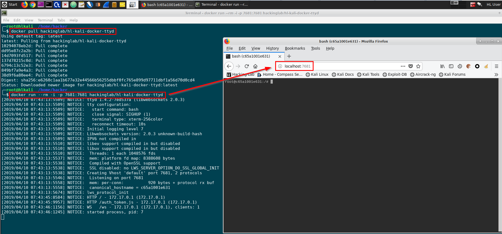

Please give it a try! I am doing this demo using the latest Hacking-Lab LiveCD from https://livecd.hacking-lab.com/, as the LiveCD has docker and everything already configured and works like charm. If you want to use the Hacking-Lab LiveCD too, please follow the following installation instructions

https://github.com/ibuetler/e1pub/tree/master/hacking-lab-livecd-installation

Once you're good, please stop the docker in the same terminal you have executed "docker run..." by pressing CTRL-C. This will shutdown the ttyd docker service. It must be shutdown for the next steps. 


## Traefik Load Balancing Service
I run all my docker services `behind` traefik (https://traefik.io/). I do not want to have my (hundreds of) docker services, APIs, RESTful APIs and more directly accessible from the Internet (security). I do not want to create and handle SSL/TLS certificates for every single docker services. In production; I am using an SSL wildcard certificate or Let's Encrypt TLS and point it to the traefik ip address. In development; Traefik is automatically creating self-signed certificates for me. This is what we want in this tutorial. Needless to say, Traefik is a docker service too. 


Traefik terminates TLS/SSL and routes everything, based on HOST or URL pattern rules, to the designated docker-based and on-demand back-end service. Furthermore, traefik is docker-aware and allows registering or unregistering docker services without restarting traefik. 

Before we proceed with setting up our traefik docker, please pull the workshop github repo first. This will save you time as the traefik and all other docker-compose.yml files are ready for testing in the workshop repo. 


## Pull Workshop Github Repository
Please pull the workshop repo using the following commands. I have chosen `/opt/git/` as the base directory for this tutorial. Change it to whatever you like or prefer. 

```
mkdir -p /opt/git
cd /opt/git
git clone https://github.com/ibuetler/docker-keycloak-traefik-workshop.git
cd /opt/git/docker-keycloak-traefik-workshop/
ls -al 
```
The command `ls -al` is listing the directory of the workshop files. You should have multiple files and directories we need in this tutorial. 


### Step 1: Create Docker Transit Networks
Traefik itself must be assigned to every docker network it will route packages to and from. The workshop demo is based on a docker network between Traefik and the IdP (Keycloak) and another docker network between Traefik and our sample application (ttyd). The following commands will create the transit_idp and transit_ttyd networks for you. 

```
cd /opt/git/docker-keycloak-traefik-workshop/traefik
bash create_network.sh
```


This will create the transit networks for you. If you don't want to run the script, you can run the commands manually

```
docker network create transit_idp
docker network create transit_ttyd
```

### Step 2: Run Traefik
Next we want to run the traefik service. There is a docker-compose.yml available. Please follow the instructions below. This will pull the traefik image and starts traefik in daemon mode. Using the command `docker-compose logs -f`, you can see the traefik service log which is set to DEBUG.  

```
cd /opt/git/docker-keycloak-traefik-workshop/traefik
docker-compose up -d 
docker-compose logs -f
```


### Step 3: Run ttyd together with Traefik
You should have tested ttyd in `Step 1` and Traefik should be up and running in `Step 2`. Time to test, how to connect these two docker services together. Please open a new root terminal. 

The commands below will start the ttyd docker and is registering the ttyd service to traefik. The magic is within the traefik labels of the `docker-compose.yml` file. Please make sure your traefik service is still running from `Step 2`

```
cd /opt/git/docker-keycloak-traefik-workshop/ttyd
docker-compose up -d
docker-compose logs -f
```

### Step 4: Add three hosts into /etc/hosts
Before you can test the traefik and ttyd daemon, you must add three host entries into the /etc/hosts file. This is, because we do the demo without real DNS names. 

```
echo "127.0.0.1       ttyd.idocker.hacking-lab.com" >> /etc/hosts
echo "127.0.0.1       auth.idocker.hacking-lab.com" >> /etc/hosts
echo "127.0.0.1       traefik.idocker.hacking-lab.com" >> /etc/hosts
```

### Step 5: Testing ttyd via traefik
Now you should have the /etc/hosts entries, in one linux terminal you should have your traefik docker service up and running and in another linux terminal you should have the ttyd docker service up and running. 

Can you answer all these `pre-requirements` with YES? 

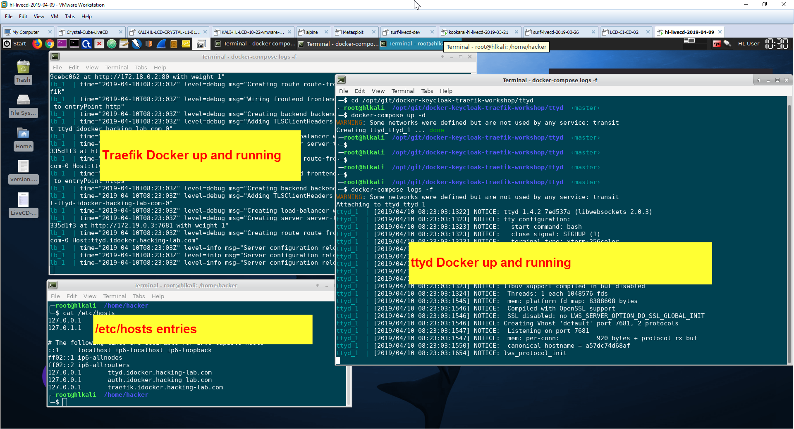

Ok, then let's see how it works using the browser. 

Please open Firefox and point your browser to https://ttyd.idocker.hacking-lab.com 


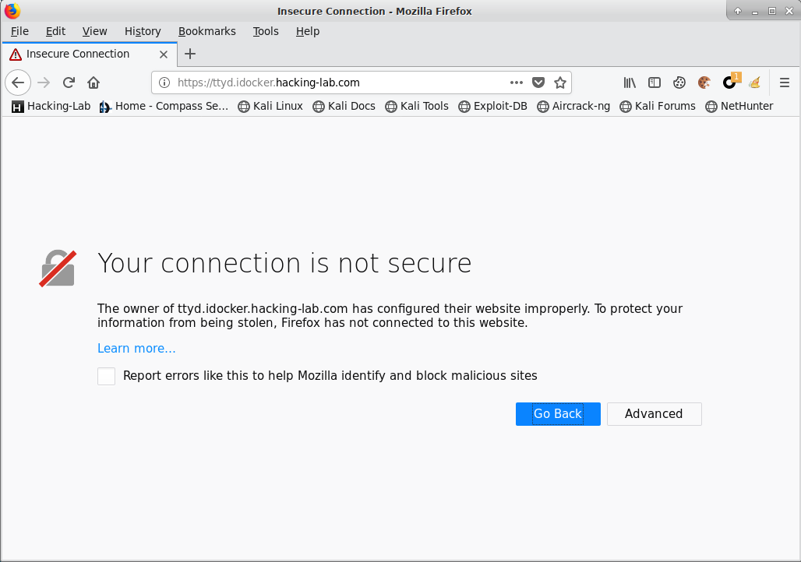


Due to the self-signed TLS certificates (traefik will generate them on the fly for you) you must click on "Advanced" and "Add Exception" to proceed. And as you can see in the screenshot below, the ttyd is not secured with the https of the traefik load balancer (but still without authentication). 


## Conclusion Step 1-5
If you did the tutorial until here? This is awesome. Until now you have setup a load balancer (traefik) and you put a service (ttyd) behind the load balancer. You have SSL/TLS up and running and the dynamic registration of your application (ttyd) with traefik works like charm. You have not yet added authentication to it (next step) but still, this is a first success. 


## Keycloak Setup
For the sake of this tutorial I use keycloak, an open-source identity provider `IdP` that runs smoothly with docker. If you don’t know keycloak, I encourage you to get into this project. It is the open source version of the RedHat RH-SSO solution. 

We need to setup and configure Keycloak. Thus, please follow the instructions below, assuming have successfully done step 1 to step 5 in this tutorial. 

Please open another new linux terminal. 

```
cd /opt/git/docker-keycloak-traefik-workshop/keycloak
docker-compose up -d  
```

If you run this the first time, it will pull the keycloak images/

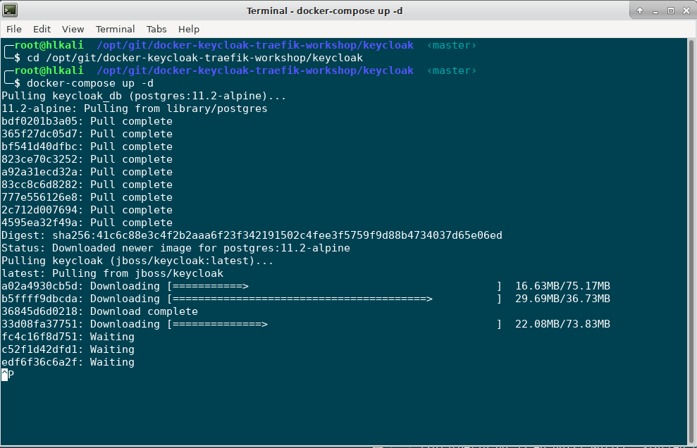

Once the prompt returns, you can start monitoring the logs

```
cd /opt/git/docker-keycloak-traefik-workshop/keycloak
docker-compose logs -f 
```

You must wait 30-60 seconds before keycloak is fully setup. Plese wait some time. 

Afterwards, you should be able to use Firefox to reach your newly created IdP. 

* https://auth.idocker.hacking-lab.com/


Traefik is issuing another self-signed TLS certificate. 

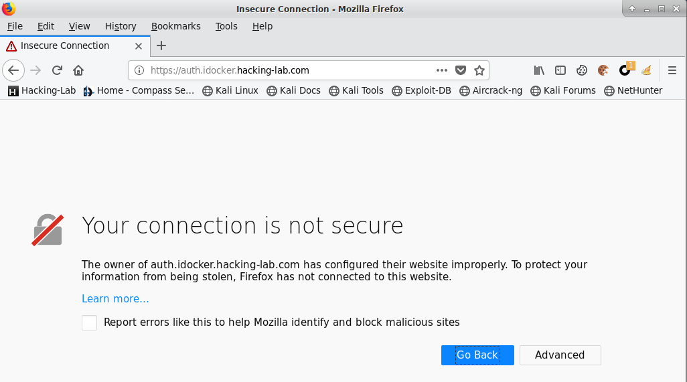

Please proceed again and you should see the IdP login prompt. 

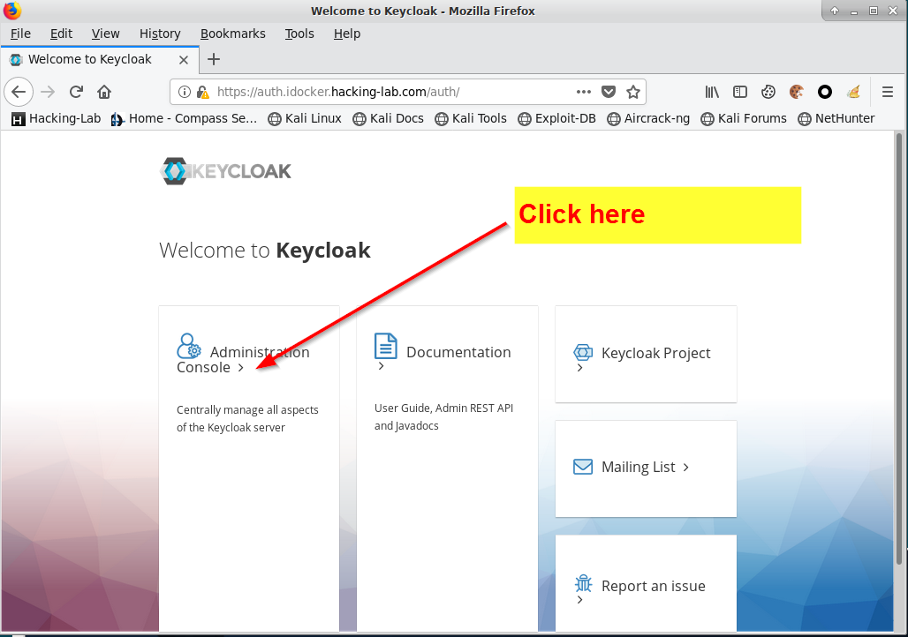

```
username: admin
password: changeme-keycloak
```


And voilà, your keycloak IdP should be up and working

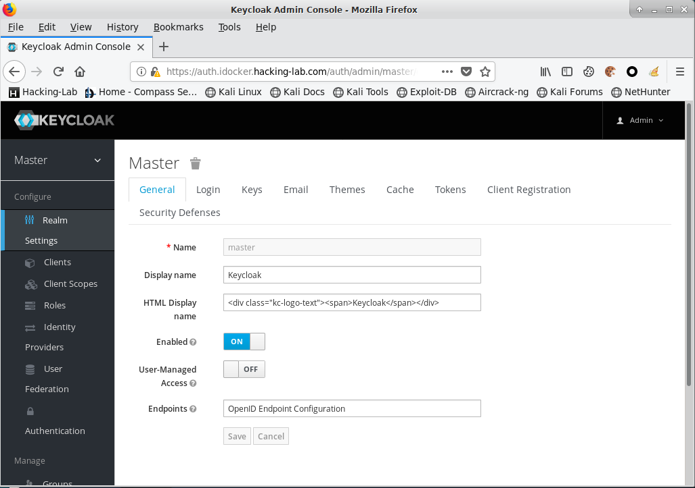


## Conclusion "Keycloak Setup"
If you did the tutorial until here? You are awesome. You have now Keycloak IdP, together with Traefik up and running. Keycloak is not yet setup for you. But still, this is great work. Well done!


## Final Demo Setup
Please note; We want to secure an application (ttyd) that comes without built-in authentication and authorization and have therefore configured `traefik`, `keycloak` and `ttyd` in the steps above. 

What is the final step? A new docker is required. The `keycloak-gatekeeper` docker image in front of the ttyd docker will do the job for us. The `keycloak-gatekeerp` docker service will ensure users must authenticate before the ttyd service can be used. In other words, keycloak-gatekeeper is kind of a reverse-proxy in front of our application that has no built-in authentication and authorization layer but integrates very well with Keycloak IdP. 


As you can see in the picture above, traefik is handling all internet traffic and forwards the traffic to the backend service(s). Backend services are not configured statically, instead they register on-demand once we spin-up the backend docker service.  

## Keycloak Gatekeeper
With OIDC (openid-connect), the client and IdP are sharing a shared secret. Thus, we must first setup a new client in Keycloak and copy the secret from there. We must then use the new key in our keycloak-gatekeeper configuration. These are the lasts steps in this tutorial. 

## Create New Client in Keycloak
You must create a new client in Keycloak. Please follow the screenshots below. Please click on "Clients" in the left menu and then click on "Create" as in the picture below. 

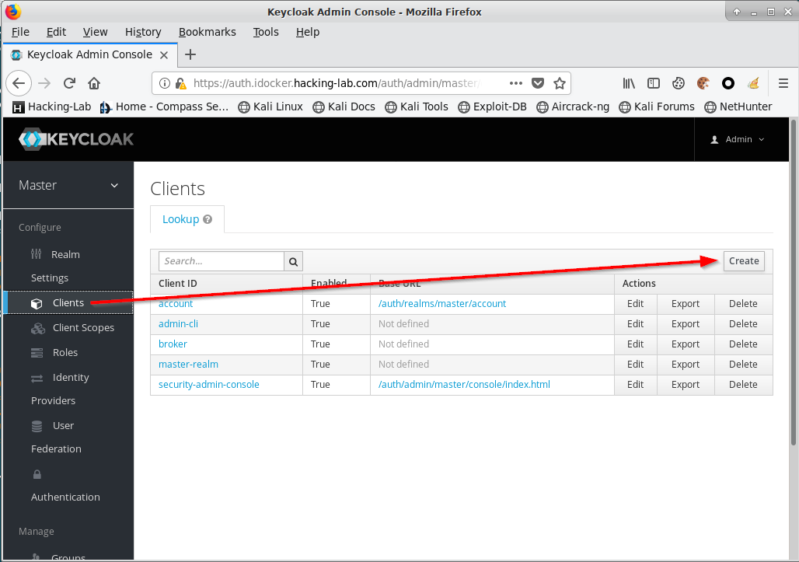

Please give it a name and configure the client URL. For this tutorial `https://ttyd.idocker.hacking-lab.com` 

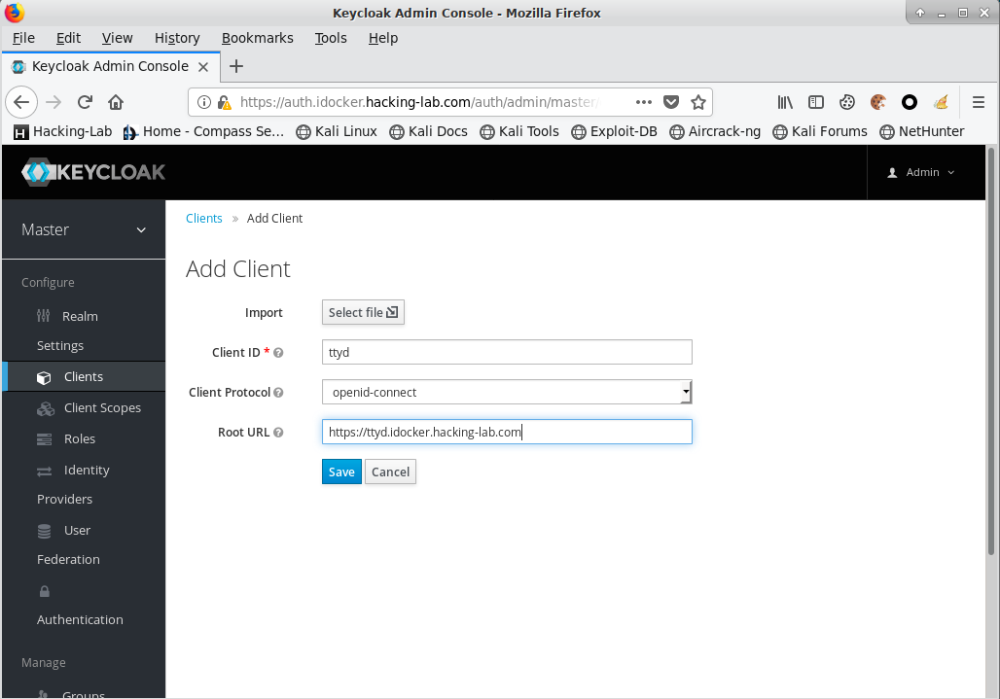

Press choose "confidential" in the "Access Type" item and press "Save"

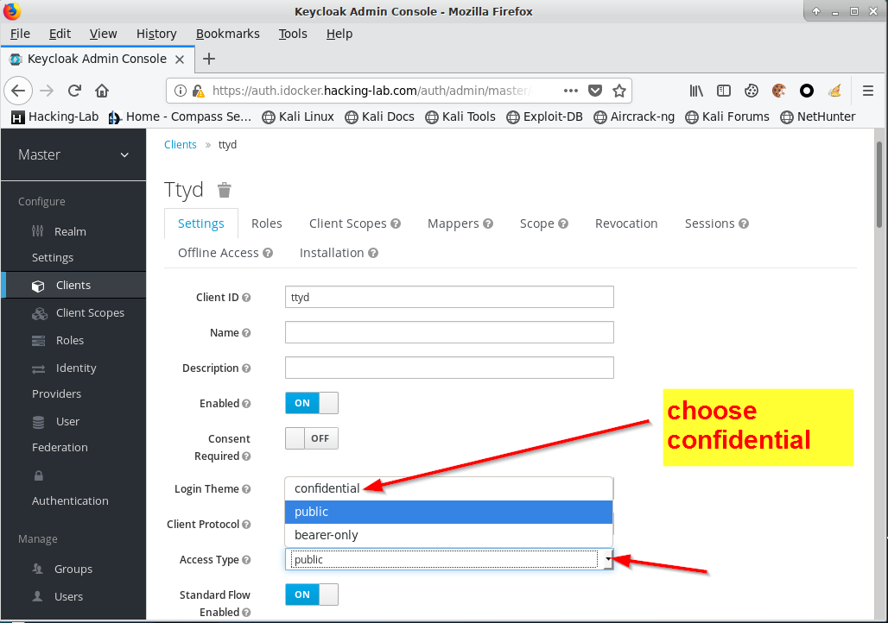

After saving, please click the "Credentials" menu item where you will find the secret we need for keycloak-gatekeeper. Copy the Secret as you need it later when configuring `keycloak-gatekeeper`


## Create Client Audience and Scope
With the new Keycloak software, a user must be assigned to a valid audience and scope before he or she can use a keycloak enabled service. Thus, let's configure the audience and scope. 

Please click on "Client Scopes" in the left menu and press "Create"

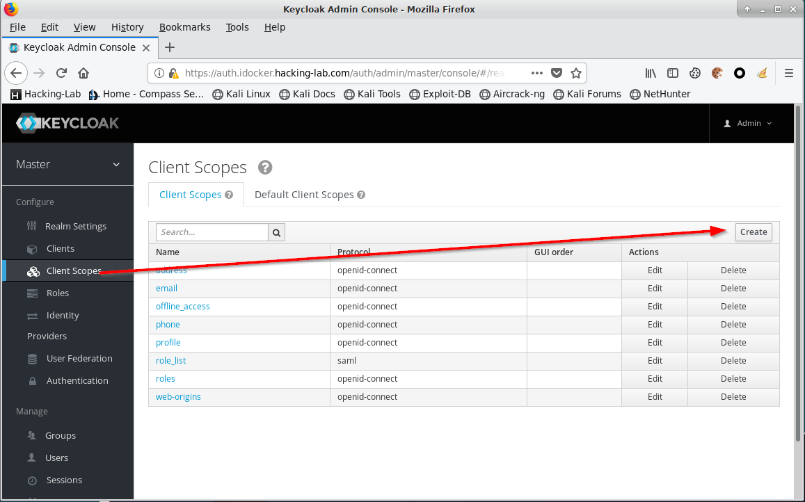

Give a Name and Description. I have chosen ttyd. 


Please click on "Mappers". 

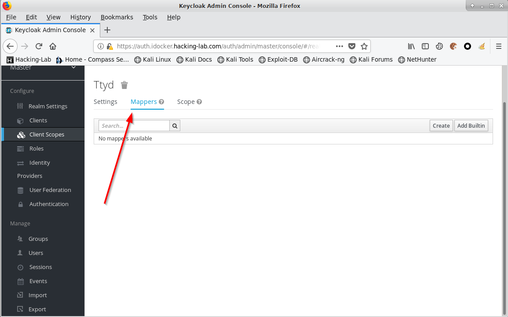

Please configure the mapper the same as in the screenshot below. Most important, you must use `Audience` in the mapper type field. 

1. Name = ttyd 
2. Mapper Type = Audience
3. Add to ID token = ON
4. Add to access token = ON 


Last, you must apply the newly created mapper to your ttyd client configuration. 


Now you have successfully finished the keycloak configuration for the new (ttyd) client application. 

The settings are applied to the "Master Realm". If we would have created a new REALM when we started configuring keycloak, this could easily applied to your self-defined REALM. If the last sentence makes no sense for you; don't worry. You can play with the Keycloak Realms (organisation, entity) later on your own. 


## Enable User Self-Registration
Please turn-on self-registration on the Master Realm Settings tab. 

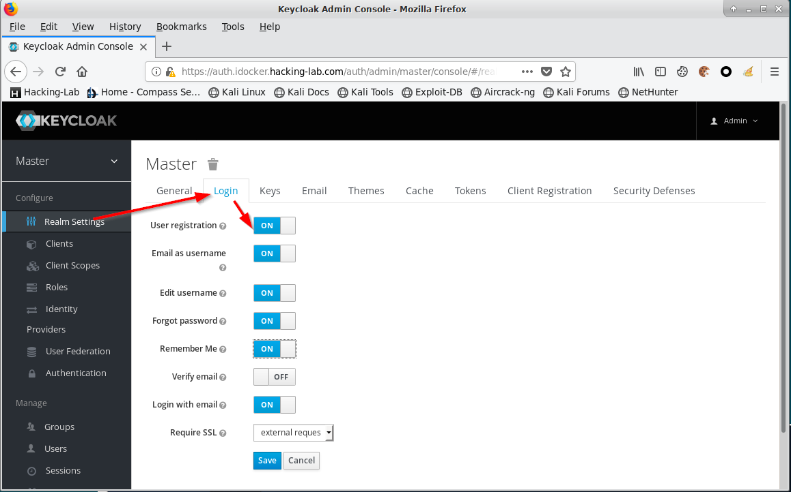

## Testing User Self-Registration
Please start in Firefox a "New Private Window" and connect to the following URL

https://auth.idocker.hacking-lab.com/auth/realms/master/account


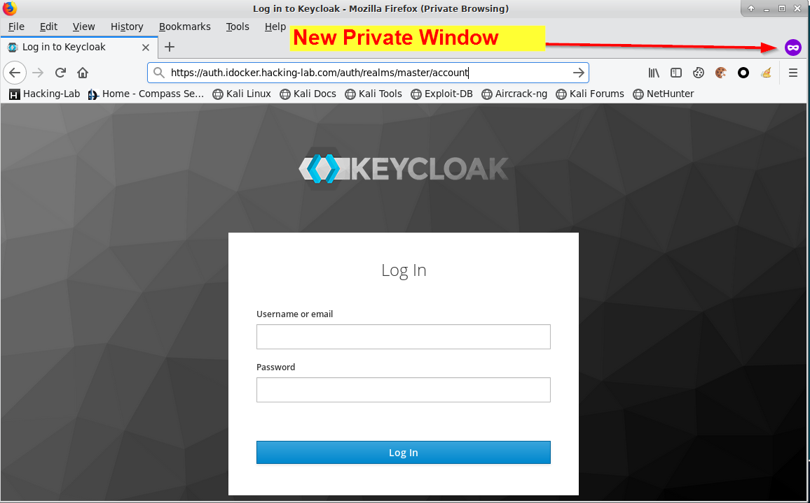

Please register a new account

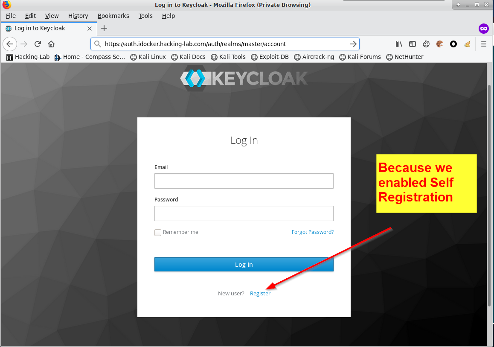

Enter your data here


Use your Firefox instance where you are logged-in as `admin` and check if the user has been created. 

PS: you can setup the user directly within keycloak, if you want. This steps were more to say: "hey, users can self-register in keycloak"

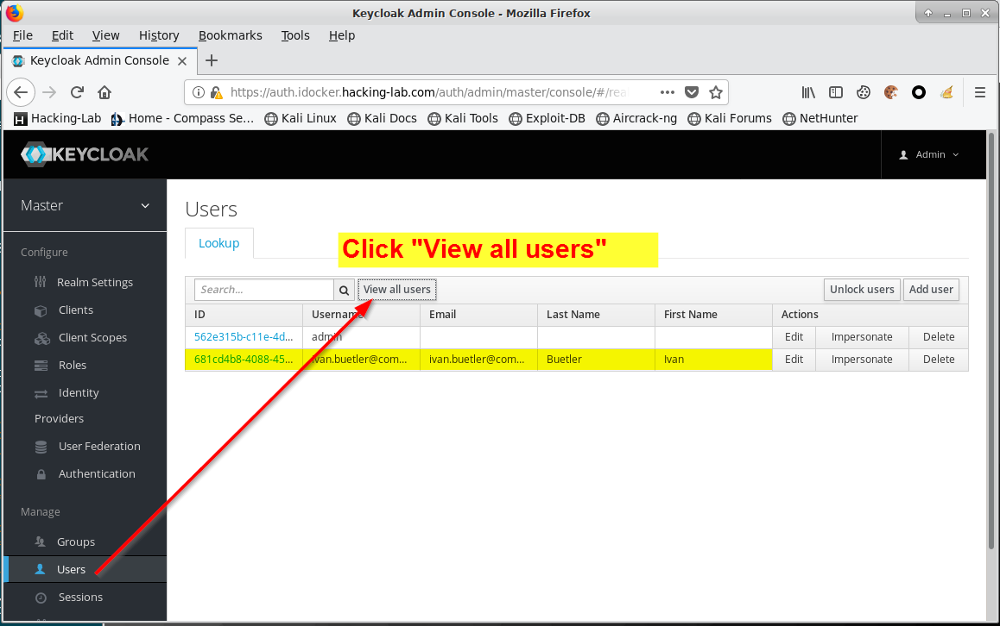


## Conclusion "Keycloak Client Configuration"
Did your really the tutorial until here? This is extremly passionate. Let's briefly give some conclusion what you have reached so far. You did the client configuration in Keycloak, you have created the mappers (access control for the service) and you have created and copied the client secret. 

Furthermore, you have configured the login service to allow self registration and you have tested this by self-registering a test user in a "New Private Browsing Firefox" session. Lastely, you have checked if the newly created user is being listed/available in Keycloak. This is mandatory to have a test account for the next step. 

If you have not missed anything of the steps above, you should now be ready for the last step, configuring keycloak-gatekeeper and applying authentication to the ttyd docker application. 


## Keycloak Gatekeeper
First of all, please stop the ttyd docker (only the tty docker, but keep the keycloak and traefik docker up and running). We will start the ttyd together with keycloak-gatekeeper. That's why we must stop it here. 

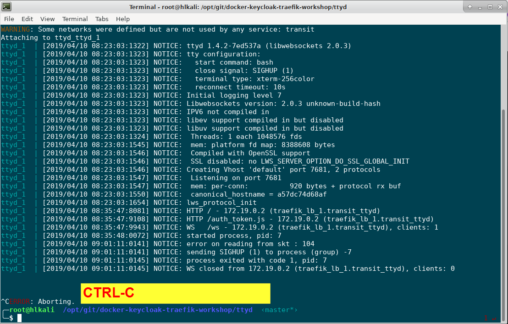

### Configure Client Secret
Please configure your keycloak-gatekeeper with your client secret. 
```
cd /opt/git/docker-keycloak-traefik-workshop/keycloak-gatekeeper
mousepad keycloak-gatekeeper.conf
```

Please specify your own client secret. Everything else can be the same as in the screenshot below. 

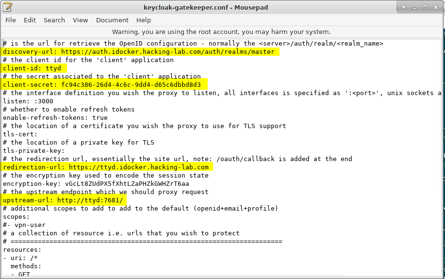

If you don't remember, the client secret comes from the client configuration tab. Copy your value from there. 


### Docker Compose
Let's briefly check the docker-compose.yml. This will start your `keycloak-gatekeeper` and the `ttyd` docker service. They share the `transit_ttyd` network. 

```
cd /opt/git/docker-keycloak-traefik-workshop/keycloak-gatekeeper
╰─$ cat docker-compose.yml                                             
version: '2'

services:

  auth-proxy:
    image: hackinglab/keycloak-gatekeeper:latest
    labels:
     - "traefik.port=3000"
     - "traefik.frontend.rule=Host:ttyd.idocker.hacking-lab.com"
     - "traefik.protocol=http"
    networks:
      transit_ttyd:
    volumes:
      - ./keycloak-gatekeeper.conf:/etc/keycloak-gatekeeper.conf
    entrypoint:
      - /opt/keycloak-gatekeeper
      - --config=/etc/keycloak-gatekeeper.conf

  ttyd:
    image: hackinglab/hl-kali-docker-ttyd
    networks:
      transit_ttyd:
    labels:
      - "traefik.enable=false"


networks:
  transit:
  transit_ttyd:
    external: true


```

Now, let's start keycloak-gatekeeper & ttyd using docker-compose

```
cd /opt/git/docker-keycloak-traefik-workshop/keycloak-gatekeeper
docker-compose up -d 
docker-compose logs -f
```
